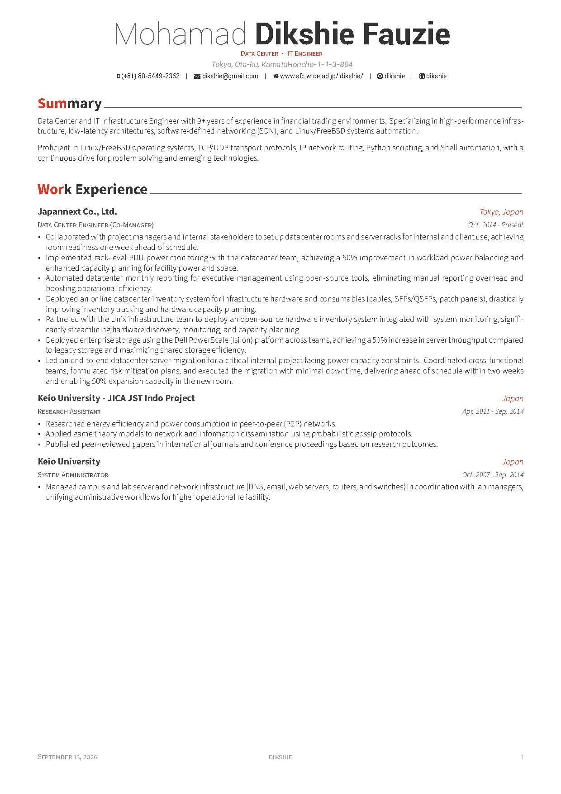
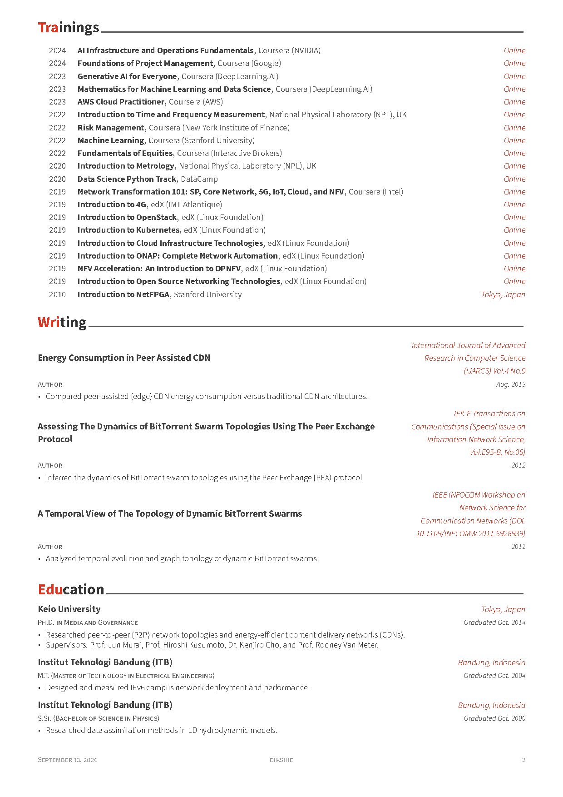
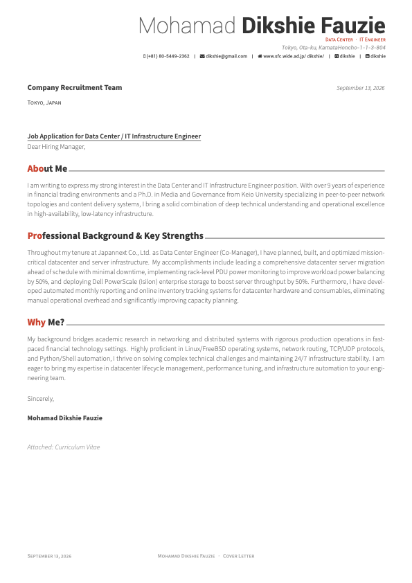

<h1 align="center">
  
  <br />
  Awesome CV & Resume
</h1>

<p align="center">
  Mohamad Dikshie Fauzie — Data Center & IT Infrastructure Engineer
  <br />
  Curriculum Vitae, Résumé, and Cover Letter LaTeX Templates
</p>

<div align="center">
  <a href="https://github.com/dikshie/Awesome-CV/actions">
    
  </a>
  <a href="https://github.com/dikshie/Awesome-CV/releases/latest">
    
  </a>
  <a href="https://github.com/dikshie/Awesome-CV/releases/latest/download/resume.pdf">
    
  </a>
  <a href="https://github.com/dikshie/Awesome-CV/releases/latest/download/cv.pdf">
    
  </a>
  <a href="https://github.com/dikshie/Awesome-CV/releases/latest/download/coverletter.pdf">
    
  </a>
</div>

<br />

## Overview

This repository maintains the LaTeX sources and automated build/release pipeline for:
* **Résumé**: [`examples/resume.tex`](examples/resume.tex) ([Download PDF](https://github.com/dikshie/Awesome-CV/releases/latest/download/resume.pdf))
* **Curriculum Vitae (CV)**: [`examples/cv.tex`](examples/cv.tex) ([Download PDF](https://github.com/dikshie/Awesome-CV/releases/latest/download/cv.pdf))
* **Cover Letter**: [`examples/coverletter.tex`](examples/coverletter.tex) ([Download PDF](https://github.com/dikshie/Awesome-CV/releases/latest/download/coverletter.pdf))

For detailed workflow documentation, local compilation, and release instructions, refer to [**WORKFLOW.md**](WORKFLOW.md).

---

## Preview

#### Résumé
[Download Latest PDF](https://github.com/dikshie/Awesome-CV/releases/latest/download/resume.pdf)

| Page 1 | Page 2 |
|:---:|:---:|
| [](https://github.com/dikshie/Awesome-CV/releases/latest/download/resume.pdf) | [](https://github.com/dikshie/Awesome-CV/releases/latest/download/resume.pdf) |

#### Cover Letter
[Download Latest PDF](https://github.com/dikshie/Awesome-CV/releases/latest/download/coverletter.pdf)

| Cover Letter |
|:---:|
| [](https://github.com/dikshie/Awesome-CV/releases/latest/download/coverletter.pdf) |

---

## How to Build

### Requirements
* **XeLaTeX** (TeX Live 2021 or newer recommended)
* Bundled fonts in `fonts/` (Roboto and FontAwesome)

### Build Commands
Prefix commands with `rtk` (Rust Token Killer) for optimized terminal output:

```bash
# Build all documents
rtk make all

# Build individual documents
rtk make resume
rtk make cv
rtk make coverletter

# Force clean rebuild
rtk make -B all

# Clean temporary build artifacts
rtk make clean
```

---

## Automated Releases

Pushing an annotated git tag automatically triggers the GitHub Actions release workflow to compile the documents and attach `resume.pdf`, `cv.pdf`, and `coverletter.pdf` to a new release:

```bash
rtk git tag v1.0.1 -m "Release v1.0.1"
rtk git push origin v1.0.1
```

See [**WORKFLOW.md**](WORKFLOW.md) for step-by-step guidance.

---

## Credits & License

* Template original design by [Claud D. Park (posquit0)](https://github.com/posquit0/Awesome-CV).
* Licensed under [CC BY-SA 4.0](https://creativecommons.org/licenses/by-sa/4.0/).
